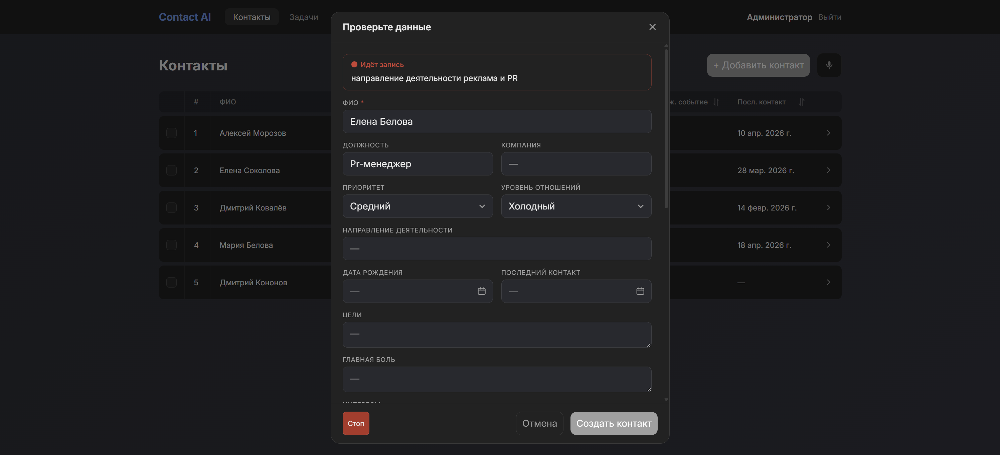
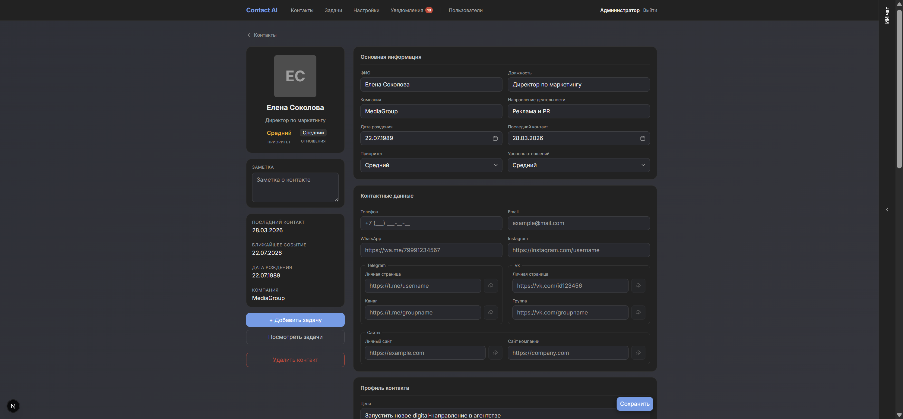
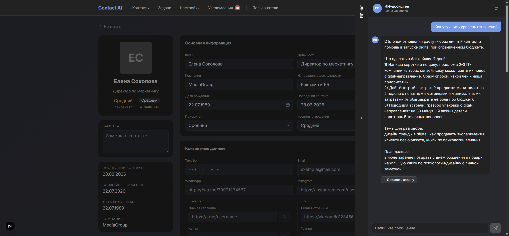
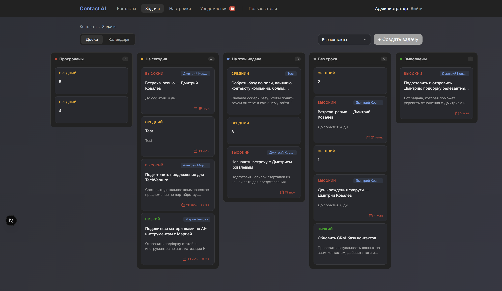
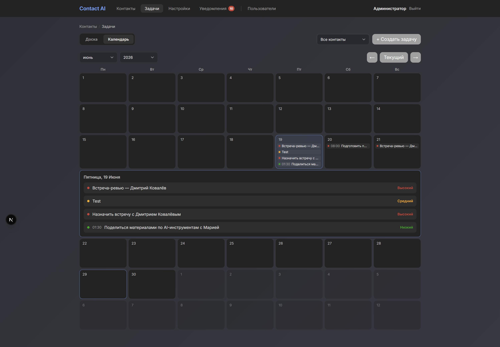
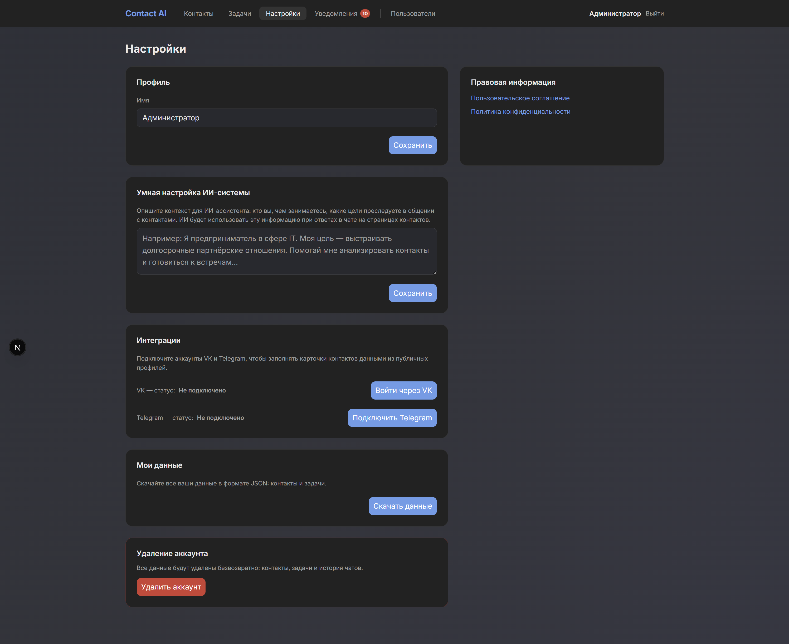

# Contact AI

AI-CRM для управления деловыми контактами. Продакшен-проект, разработан как fullstack MVP с нуля.

Каждый контакт - это структурированная карточка (должность, компания, цели, боли, интересы, важные даты) и персональный AI-чат, который использует эти данные для практических советов по развитию отношений.

---

## Интерфейс

<table>
  <tr>
    <td width="50%" valign="top">
      <b>Голосовое создание контакта</b> 
      описание голосом в свободной форме, AI распознаёт речь и сам структурирует карточку 
      
    </td>
    <td width="50%" valign="top">
      <b>Карточка контакта</b> 
      структурированные поля: цели, боли, интересы, важные даты, данные о компании 
      
    </td>
  </tr>
  <tr>
    <td width="50%" valign="top">
      <b>AI-чат на карточке контакта</b> 
      ассистент берёт данные карточки как контекст и выдаёт конкретный план действий 
      
    </td>
    <td width="50%" valign="top">
      <b>Доска задач с drag-and-drop</b> 
      
    </td>
  </tr>
  <tr>
    <td width="50%" valign="top">
      <b>Календарь задач</b> 
      
    </td>
    <td width="50%" valign="top">
      <b>Умная настройка AI-системы (кастомный системный промпт) и интеграции VK / Telegram</b> 
      
    </td>
  </tr>
</table>

---

## Стек

| | Технологии |
|---|---|
| **Frontend** | Next.js 16, React 19, TypeScript, Zustand, SCSS Modules, Framer Motion |
| **Backend** | NestJS 11, TypeScript, MySQL, Drizzle ORM |
| **AI** | OpenAI API, кастомный системный промпт, структурированные JSON-ответы |
| **Интеграции** | VK ID OAuth + PKCE, Telegram MTProto (gramjs), cheerio |
| **Тесты** | Vitest, React Testing Library, MSW, Playwright |
| **DevOps** | GitHub Actions (CI/CD), Nginx, PM2 |
| **Инструменты** | Claude Code |

---

## Возможности

### AI-функции
- **AI-чат на каждый контакт** - контекстный ассистент использует полную карточку как системный контекст: помогает с тактикой общения, формулирует сообщения, предлагает задачи
- **Голосовое создание контакта** - описание в свободной форме, AI структурирует карточку
- **Автообогащение из соцсетей** - заполняет пустые поля из профиля VK / Telegram; конфликты с уже заполненными полями логируются для ручного разрешения
- **Анализ активности VK** - парсит посты за 7 дней, генерирует сводку активности, список актуальных тем и поводы для разговора
- **Скрапинг сайтов** - cheerio-парсинг личного / корпоративного сайта с извлечением профессиональных данных
- **AI-метаданные задачи** - из произвольного описания извлекает название, приоритет, дедлайн

### Контакты и задачи
- Карточки с расширенными полями: цели, боли, мечта, личные черты, взаимная польза
- Контактная информация: телефон, email, ссылки на Telegram, VK, Instagram, WhatsApp
- Важные даты, загрузка фото, экспорт данных
- Задачи с приоритетом, дедлайном, статусом выполнения; доска с drag-and-drop

### Интеграции соцсетей
- **VK** - OAuth 2.0 + PKCE (VK ID), скрапинг профиля, анализ стены
- **Telegram** - MTProto-логин (номер телефона + 2FA или QR-код), скрапинг профиля и групп/каналов

---

## Безопасность

- JWT в `httpOnly + Secure + SameSite=Strict` cookies - токены недоступны из JS
- Refresh-токен rotation: повторное использование отозванного токена инвалидирует все сессии пользователя
- AES-256-GCM шифрование чувствительных полей контакта и истории чата в БД; поддержка ротации ключей без простоя
- Rate limiting: глобальный + отдельные лимиты на `/auth/login`, `/auth/refresh`, `/ai`, `/admin`
- helmet со строгим CSP в production (`default-src 'none'`); HTTP Security Headers на фронтенде (HSTS, X-XSS-Protection, X-Frame-Options)
- RBAC с проверкой роли по БД на каждый запрос (не только из JWT payload)
- Аудит-лог: каждая мутирующая операция логируется с entity, action, user ID, IP
- Защита от prompt injection в каждом AI-запросе
- Gitleaks в CI - сканирование коммитов на утечки секретов

---

## Тесты и CI/CD

- **~80% покрытия unit-тестами** (Vitest + React Testing Library + MSW)
- **60+ E2E-тестов** (Playwright) - прогон перед каждым деплоем
- **CI:** typecheck, npm audit, unit-тесты, сборка - запускается только для изменившихся частей (frontend / backend)
- **CD:** автодеплой на сервер по SSH при успешном CI; бэкап БД перед DDL-миграциями

---

## Claude Code

Разработка велась с Claude Code (Anthropic):

- **Скорость разработки** - генерация бойлерплейта, рефакторинг, навигация по кодовой базе, черновики реализации фич
- **Автогенерация тестов** - AI пишет черновики unit-тестов, каждый проходит обязательное ручное ревью перед коммитом; в CI тесты прогоняются как обязательный quality gate
- Итоговые архитектурные и продуктовые решения остаются за разработчиком

---

## Документация

- [backend/README.md](./backend/README.md) - архитектура NestJS, БД, AI-модуль, безопасность
- [frontend/README.md](./frontend/README.md) - FSD-архитектура, state management, тесты
